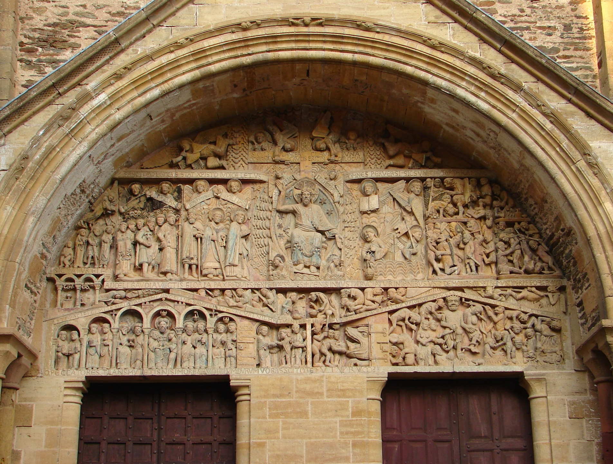
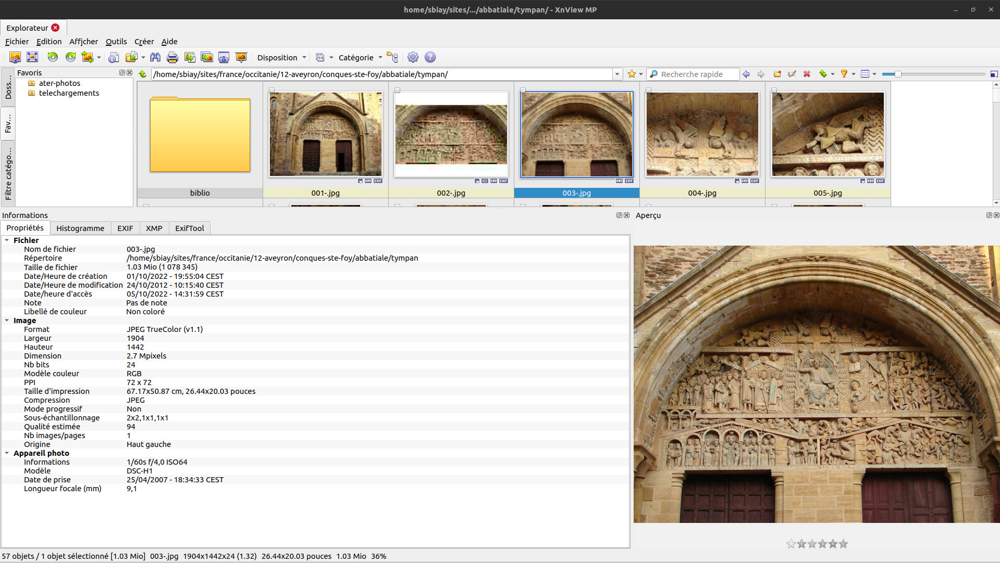
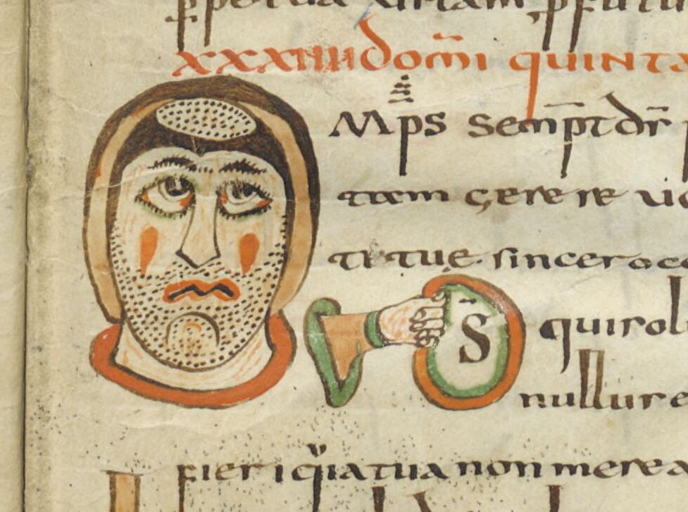

Plan :

1. [Introduction : Image et information](#t1)
2. [Créer une méthode de sauvegarde avec FreeFileSync](#t2)
3. [Traiter des fichiers-images](#t3)

[comment]: <> (FINET)

<a id='t1'/>

# Introduction : Image et information
[comment1]: <1> (TITRE1)

### <2>

### <3>

C'est le tympan du Jugement dernier de Sainte-Foy de Conques en Aveyron

Ces informations peuvent être associées à l'image de trois manières :

1. **Chemin** de l'image (arbre des dossiers qui la contiennent)
	- ma-recherche/images/**france/aveyron**/conques/
	- ma-recherche/images/**sculpture/tympans**/conques/
	- ma-recherche/images/**epoque-romane**/conques/

2. **Nom** de l'image, deux stratégies :
	1. Beaucoup de dossiers, un nom court :
		- ma-recherche/images/france/aveyron/conques/**01.jpg**
	2. Peu de dossiers, un nom long :
		- ma-recherche/images/**conques-jugement-dernier.jpg**

3. **Métadonnées** de l'image

### <4>

1. Pas de nom de fichier trop long !
	
	- **conques-jugement-dernier-vue-generale-cliche-fr.wikipedia.org.jpg**

2. Éviter les caratères spéciaux
	
	- Espaces
	- \?§&"'()\#\[\]

3. Éviter même les caractères accentués.
La typographie la plus sûre est du type :
	
	- `conques-jugement-dernier.jpg`
	- `conques_jugement_dernier.jpg`

### <5>

Ou faire une **base de données** (c'est un autre chapitre du cours)

<a id='t2'/>

# Créer une méthode de sauvegarde avec FreeFileSync
[comment2]: <5> (TITRE1)

[comment3]: <5> (L'idée de cette découverte d'XnView est de vous sensibiliser à la gestion de fichiers d'images à grande échelle, comment gérer ses fichiers pour mener une recherche efficace)

[comment4]: <5> (Dans un but de recherche, il est important de pouvoir associer une image à un ensemble d'informations qui sont trop complexes pour pouvoir les retenir)

### <6>

[comment5]: <6> (Présenter l'interface: )

[comment6]: <6> (- Des « actions » à gauche)

[comment7]: <6> (- Une interface de comparaison à droite)

- Créer un dossier personnel sur le bureau (si ce n'est déjà fait)

- Ouvrir FreeFileSync

- Sur Moodle, télécharger le dossier **cluny-musique** et le placer dans le dossier personnel

- Sur sa clé USB, créer un dossier **td-numerique**

- Configurer une Synchronisation dans les deux sens entre le dossier local du TD et celui de la clé USB

<a id='t3'/>

# Traiter des fichiers-images
[comment8]: <6> (TITRE1)

### <7>

**Décompresser** l'archive `cluny-musique.zip`.

**Dans XnView** :

1. Chercher le dossier `cluny-musique` via le navigateur et y entrer

2. Sélectionner toutes les images

3. Édition > Renommer (F2)

4. Donner comme nouveau nom `cluny-##` :
	- début `1`,
	- pas `1`

On obtient une numérotation continue des fichiers.

### <8>

1. Sélectionner les 8 derniers fichiers

2. Donner comme nouveau nom `{Filename}-chap-08-##`, début `1`, pas `1`

En conservant le nom du fichier, on a pu ainsi ajouter des informations et une numérotation secondaire.

### <9>

1. Sélectionner l'image `cluny-08.jpg`

2. Ouvrir l'éditeur de métadonnées IPTC (Cmd + i)

3. Ajouter des infos (inventées si besoin) dans Légende

4. Ajouter des infos dans Crédits

5. Ajouter des infos dans Mots-clés: **cloche**

6. Cliquer sur **Écrire**

### <10>

Recherchons à présent le mot-clé « cloche » :

1. Recherche (symbole des jumelles) > Ajouter > IPTCM-IM > Keywords

2. Rechercher les images qui **contiennent** « cloche »

### <11>

Au cours de ses recherches, il est commode de photographier les ouvrages que l'on n'a pas le temps de lire en bibliothèque, et encore plus commode de **renommer les photos des pages selon leur numéro**…

1. Télécharger le dossier [**`scriptorium-moissac`**](https://pedag.u-picardie.fr/moodle/upjv/mod/folder/view.php?id=259602) depuis Moodle

2. Extraire les fichiers et entrer dans le dossier avec XnView

3. Renommer les images selon leur numéro de page pour qu'elles portent le numéro inscrit en haut de la page de droite : il faut obtenir une liste qui ressemble à `p-80.JPG`, `p-82.JPG`, `p-84.JPG`…

**Lire la diapo suivante avant de commencer !!!**

### <12>

**ATTENTION** ! comme je suis un peu stupide, j'avais oublié de photographier les deux premières pages, elles sont à la fin du dossier ; je veux donc :

- que l'avant-dernière (`DSC07638.JPG`) soit placée au début et appelée `p-80.JPG` 

- que la dernière (`DSC07639.JPG`) soit placée en deuxième et appelée `p-82.JPG`

**NB** : Il est totalement interdit de renommer les images une par une… (ça ne serait pas drôle). Dans la fenêtre de renommage (F2) il existe une méthode pour changer l'ordre des fichiers, en faisant monter ou descendre certains dans la liste avant de les renommer tous ensemble…

### <13>

Il faudrait améliorer le contraste de ces photos, et comme la couleur ne sert à rien, les passer en niveaux de gris donnerait des fichiers plus légers…

1. Sélectionner toutes les images

2. Cliquer droit sur une image > Conversion par lots

3. Actions 

	- Ajouter action > Image > Modifier le nombre de couleurs > **Niveaux de gris**

	- Ajouter action > Table > Niveaux : modifier la Luminosité

5. Sortie
	
	- Créer un **Dossier**: `photos-livre-modif`

	- **Convertir**

### <14>

Faire des photos avec son téléphone, c'est rapide ; récupérer des clichés en HD des œuvres que l'on étudie, c'est encore mieux.

1. Accéder à [**cette page**](https://gallica.bnf.fr/ark:/12148/btv1b60000317/f43) sur Gallica

2. La télécharger en JPG et l'afficher dans XnView                 

### <15>

Remarquer le logo\

dans la partie gauche de l'interface de Gallica.

IIIF = *International Image Interoperability Framework*, une communauté d'institutions patrimoniales qui proposent un cadre d'**interopérabilité** (qui fonctionne de la même manière dans toutes les institutions) pour partager des images en HD sur le web.

Ce partage se fait via une **API** (*Application Programming Interface*), une interface web uniquement pour les programmeurs et les machines, et non pas un site web que l'on peut visiter.

### <16>

Pour accéder à l'image depuis l'API Gallica modifier l'URL comme ceci : 

gallica.bnf.fr/

**iiif**/

ark:/12148/btv1b60000317/f43/

**full/full/0/native.jpg**

*****

Télécharger l'image au même endroit que la première fois, comparer les métadonnées des images.\
Qu'en déduisez-vous ?

### <17>

L'API permet de modifier le fichier image en intervenant sur les paramètres de son URL. Cliquer sur les points suivants et regarder en quoi l'URL est différente :

1. [Rotation à 90°](https://gallica.bnf.fr/iiif/ark:/12148/btv1b60000317/f43/full/full/90/native.jpg)

2. [Résolution limitée à 1200 px de largeur](https://gallica.bnf.fr/iiif/ark:/12148/btv1b60000317/f43/full/1200,/0/native.jpg)

2. [Résolution limitée à 1200 px de hauteur](https://gallica.bnf.fr/iiif/ark:/12148/btv1b60000317/f43/full/,1200/0/native.jpg)

### <18>

1. Copier l'URL https://gallica.bnf.fr/ark:/12148/btv1b60000317/f43 et la coller dans [**Dezoomify**](https://dezoomify.ophir.dev/)

2. Télécharger cette nouvelle image et la comparer aux autres, notamment la métadonnée « Dimension »

>

Remarque, l'image téléchargée de Dezoomify est plus lourde (PNG 34 bits au lieu de Jpeg 24 bits).\
Pour la transformer en Jpeg plus léger dans XnView : Faire un clic droit sur l'image > Convertir en > JPG

### <19>

Dezoomify est capable d'extraire des photos en HD depuis des collections en ligne :

- Où le téléchargement en définition moyenne, comme l'**Art Institute de Chicago** (voir la chambre de Van Gogh [**ici**](https://www.artic.edu/artworks/28560/the-bedroom))

- Où le téléchargement n'est pas proposé ! comme la **British Library** (voir le Psautier Vespasien [**ici**](https://www.bl.uk/manuscripts/Viewer.aspx?ref=cotton_ms_vespasian_a_i_f030v))

Vous pouvez coller les URL de ces pages dans Dezoomify et accéder au fichier.

**NB** : trouver l'URL d'une image est parfois tout un jeu de piste…

### <20>

Des extensions de navigateur pour aller plus vite :

1. Dezoomify est aussi une extension de Firefox [**ici**](https://addons.mozilla.org/fr/firefox/addon/dezoomify/)

2. [**Geobib**](http://www.geobib.fr/tool/iiif/) peut télécharger des images HD de **Gallica** en un clic

### <21>

1. Manuscrits et livres rares : voir la plateforme [**Biblissima**](https://iiif.biblissima.fr/collections/)

2. Inventaires des collections par l'[**Université de Leyde**](https://www.library.universiteitleiden.nl/binaries/content/assets/ul2ub/bijzondere-collecties/list-of-iiif-collections.pdf)

### <22>

1. Le fichier contenant toutes les URL des images s'intitule comme ceci : https://gallica.bnf.fr/iiif/ark:/12148/btv1b60000317/ **manifest.json**

2. Pour trouver les URL des images, ouvrir ce fichier dans Firefox

3. Parcourir l'arborescence : sequences > *numéro* > canvases > *numéro* > images > *numéro* > resource > **\@id**

4. Si \@id ne se termine pas par `.jpg`, essayer d'ajouter `/full/full/0/default.jpg` ou `/full/full/0/native.jpg`

