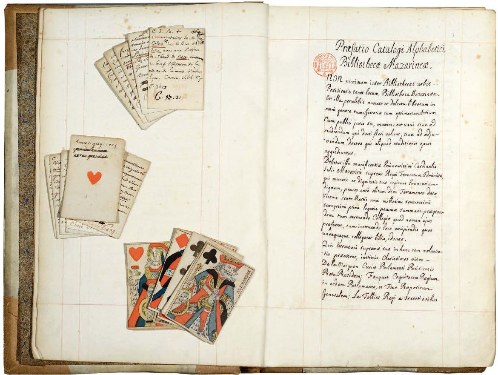
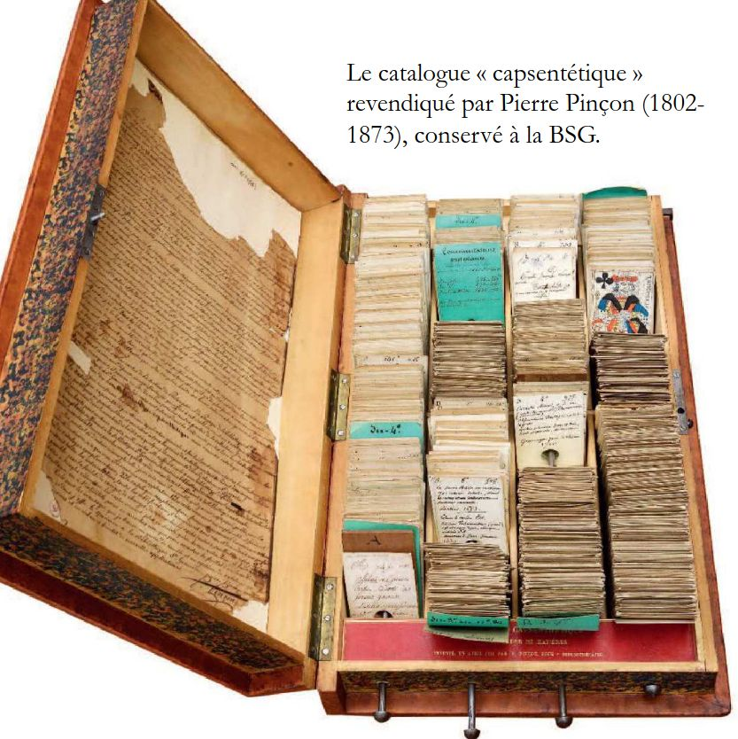
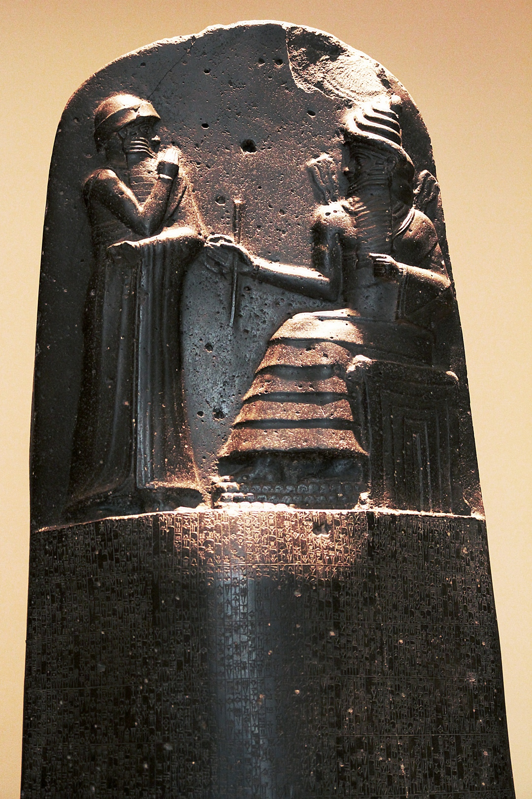
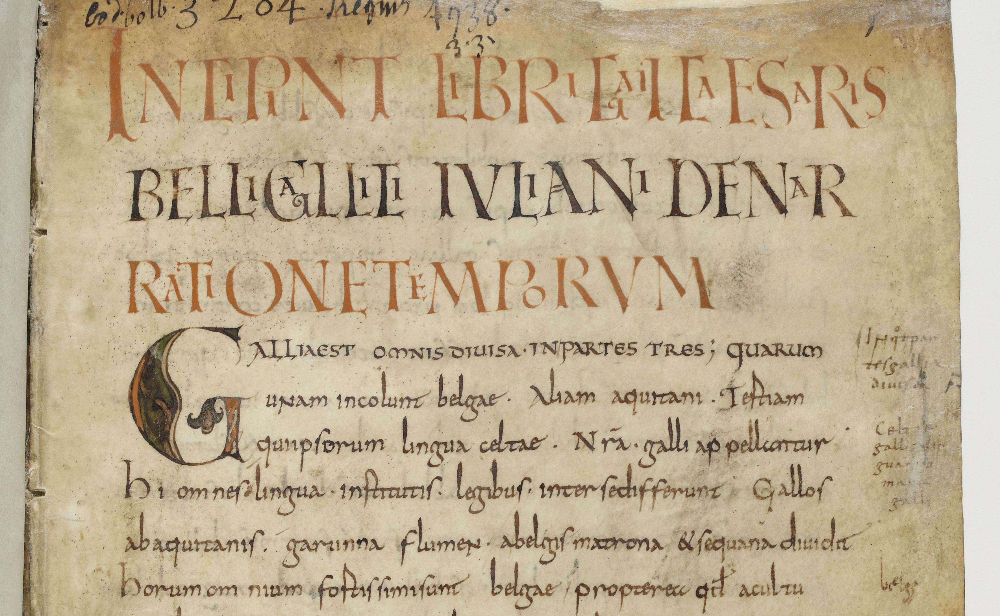

[comment1]: <1> (FINET)

[comment2]: <1> (Faire l'appel)

[comment3]: <1> (On est ensemble pour 12 séances consacrées théoriquement aux pratiques numériques pour l'histoire de l'art. Il y a plusieurs façons de l'aborder. Les ressources numériques sont désormais omniprésentes dans la recherche. C'est presque une religion: les projets de recherche ne peuvent être financés que s'ils produisent de nouvelles ressources numériques. Moi même je suis parti me former aux technologies numériques dans les dernières années, car ça m'a semblé important pour trouver du travail en histoire de l'art. Il y aurait beaucoup à dire sur le sujet, mais j'ai pensé en préparant ce cours qu'il ne fallait pas mettre la charrue avant les boeufs. 12h ensemble c'est peu et je préfère que l'on travaille sur des choses qui vous seront immédiatement utiles pour boucler votre master plutôt que de philosopher sur comment la recherche met en œuvre des pratiques numériques.)

[comment4]: <1> (**Au fait, c'est quoi le numérique ?**)

[comment5]: <1> (Pour moi, les pratiques numériques correspondent à trois niveaux…)

# Les pratiques numériques : trois niveaux d'expertise

1. **La bureautique** : utiliser les logiciels
2. **L'ingénierie** : acquérir, traiter, analyser des données
3. **La programmation** : développer des ressources

# Au fait, c'est quoi le numérique ?

Le numérique est un langage qui repose sur le **calcul binaire**.

Expérimenté par les mathématiques arabes ; rendu opérationnel par **Leibniz** (1646-1716). 

4 = 100 en binaire = 1 fois 2^2^, 0 fois 2^1^, 0 fois 2^0^

[comment6]: <1> (permet de faire des calculs beaucoup plus simples en procédé mécanique ; Le langage binaire permet de coder l'information en 0 et 1; plus tard on aura l'idée de traduire le langage binaire en termes de courant électrique: voilà comment fonctionnent vos ordinateurs.)

# Au fait, c'est quoi le numérique ?

[comment7]: <1> (On peut ainsi encoder des nbs ou encoder des lettres)

[comment8]: <1> (ASCII : American Standard Code for Information; publié en 1963; conçu en 7 bits, puis 8 bits --1 octet. Désormais dépassé par UTF-8)

[comment9]: <1> (Pouvoir calculer de manière très efficace, c'est bien, cela ne permet pas de décrire la réalité du monde. Les technologies numériques ne permettent d'exprimer, de classer, d'analyser de l'information qu'à condition que cette information ait été prédécoupée.)

[comment10]: <1> (Comment vous appelez-vous ? Comment prédécouper X ? Comment l'exprimer en données ?)

# Les origines du fichage

# Les origines du fichage

[comment11]: <1> (La limite de ce catalogue: il est unique et inflammable. On va donc tenter de faire mieux et plus durable en concevant une base de données numérique adaptée à votre objet d'étude.)

# Programme du cours

1. Gérer une collection d'images avec XnView (2h)
2. Structurer du texte sous LibreOffice Writer (2h)
3. Créer une collection bibliographique avec Zotero (2h)
4. Créer une base de données relationnelle sous Calc (4h)
5. Accompagnement des devoirs (2h)

# Prérequis

- **ENT et messagerie univ** : https://www.u-picardie.fr/ent

- **Moodle** : [https://pedag.u-picardie.fr/moodle/upjv/course/view.php?id=**13289**](https://pedag.u-picardie.fr/moodle/upjv/course/view.php?id=13289)

# Sauvegarder ses données durablement

Au fait, comment sauvegardez-vous vos données ?…

# Sauvegarder ses données durablement

Quelle est la méthode de préservation des données la plus durable ?

[comment12]: <1> (Il y a dans cette salle quelqu'un qui perdra tout son mémoire à un moment donné.)

[comment13]: <1> (Ce sera peut-être vous… *Prendre un volontaire pour qu'il raconte sa méthode*.)

[comment14]: <1> (Qui pense avoir une bonne méthode ?)

[comment15]: <1> (Projetons-nous dans un monde idéal, où on aurait le temps de faire tout bien comme il faut. Vous venez de soutenir votre mémoire de master: quelle méthode choisissez vous pour que vos arrières-arrières… petits enfants puissent le lire ?)

# Sauvegarder ses données durablement

#### <2>

[comment16]: <2> (Il a 3750 ans, et il tient toujours le coup.)

[comment17]: <2> (Le tout c'est de savoir **décoder…** Combien de temps saura-t-on décoder un fichier .docx ou .pages ?)

# Sauvegarder ses données durablement

#### <3>

[comment18]: <3> (Ça tient bien aussi, depuis 11 siècles.)

# Durée de vie selon les supports physiques

- Microfilm pour les photos : 100 ans et plus
- Papier : 50-100 ans
- Disque dur : 5-10 ans

# Comparatif Cloud/support physique

- Cloud :
	- Options d'accès : Accès à partir de plusieurs appareils
	- Sécurité des données : Fort mais peut être piraté
	- Technologie de synchronisation : Mises à jour automatiques
	- Coût par unité : Gratuit ou abonnement mensuel
	- Propriété : Peut partager vos fichiers avec n'importe qui
	- Fiabilité : Le serveur peut tomber en panne dans certains cas

- Disque dur externe :
	- Options d'accès : Utiliser une connexion USB
	- Sécurité des données : Fort mais on peut se le faire voler
	- Technologie de synchronisation : Mises à jour automatiques en cas de connexion
	- Coût par unité : Achat ponctuel
	- Propriété : Sûre
	- Fiabilité : Peut se casser, des secteurs peuvent être défectueux

# Règles d'or

### <4>

1. Je sauvegarde mon travail tous les jours

2. Un support physique ET un « nuage » (*cloud*) : l'idéal !

[comment19]: <4> (Mais attention, le but n'est pas de tuer le plus d'ours polaires possibles: on ne mettra sur le cloud que les fichiers légers, ou les plus précieux)

### <5>

- J'utilise deux supports physiques localisés en deux endroits

[comment20]: <5> (Votre disque dur ne va pas vous en envoyer un message -- au fait, à partir de demain je ne marche plus !)

[comment21]: <5> (*Prise en main de FreeFileSync --au moins 20 min.*)

# Prendre en main un Mac

- Créer un dossier à son nom sur le bureau

### <6>

- Le **Doc** (le menu des applications en bas de l'écran) contient :
	- Applications favorites
	- Applications en cours de fonctionnement

- Clicher sur le **Launchpad** (bouton multicolore dans le Doc), puis saisir le début du nom de l'application

- NB : le **menu principal** de l'application en haut de l'écran

[comment22]: <6> (**fermer** les applications inutiles)

### <7>

- Cliquer sur sa fenêtre
- Cmd + Tab

	- Pour ouvrir un document dans une application spécifique
		- Clic droit puis **Ouvrir avec**
		- Glisser le document sur l'icône de l'application si elle est dans le **Doc**

- **Finder** : l'explorateur de documents
	- Ouvrir une nouvelle fenêtre 
		- Fichier > Nouvelle fen. Finder
		- Cmd + N
	- Favoris à gauche
		- Bureau
		- Téléchargements

- Annuler une action avec Cmd + Z
	- Fonctionne même sur les actions sur les fichiers sur le bureau, le finder, etc.

- Naviguer dans plusieurs fenêtres
	- Basculer
	- Mettre une fenêtre en plein écran
	- Disposer deux fenêtres côte à côte (?)

- Couper-coller
	- Win : Ctrl + X, Ctrl + V
	- Mac : Cmd + C, **Option + Cmd** + V

- Imprimer un fichier au format pdf :
	- Win : Ctrl + P
	- Mac : Cmd + P

- Réaliser une capture d'écran :
	- Elle arrive sur le Bureau

- Forcer à quitter une application
	- Clic droit sur l'icône de l'application
	- Alt + Option > Forcer à quitter

# Créer une méthode de sauvegarde avec FreeFileSync

[comment23]: <7> (Présenter l'interface: )

[comment24]: <7> (- Des « actions » à gauche)

[comment25]: <7> (- Une interface de comparaison à droite)

1. Télécharger le dossier [**`jules-cesar`**](https://pedag.u-picardie.fr/moodle/upjv/mod/folder/view.php?id=255572) depuis Moodle

2. Extraire le contenu sur le bureau

3. Créer sur le bureau un dossier `disque-dur-externe`, et à l'intérieur un dossier `jules-cesar` 

4. Synchroniser les fichiers des deux dossiers `jules-cesar` en mode **Mise à jour** pour sauvegarder le dossier contenu du dossier dans `disque-dur-externe`

# Mettre à jour un premier dossier

1. Ajouter un fichier de traitement de texte dans le dossier « local » (gauche)

2. Comparer les fichiers

3. Mettre à jour

# Mettre à jour plusieurs dossiers

1. Télécharger le dossier [**`cluny-musique`**](https://pedag.u-picardie.fr/moodle/upjv/mod/folder/view.php?id=259599) depuis Moodle

2. Extraire le contenu sur le bureau

3. Ajouter un couple de dossiers (croix verte) pour que `cluny-musique` soit sauvegardé dans  `disque-dur-externe` (droite)

4. Comparer les fichiers

5. Synchroniser

# Mettre à jour dans les deux sens

1. Ajouter un fichier de traitement de texte dans le dossier `disque-dur-externe` (droite)

2. Mettre à jour

3. Changer l'option de synchronisation : **Deux sens**

4. Comparer

5. Synchroniser

# Miroir

1. Supprimer un fichier du dossier « local » (gauche)

2. Changer l'option de synchronisation : **Miroir**

3. Comparer

5. Synchroniser

L'option miroir est très utile lorsque l'on doit **travailler sur plusieurs ordinateurs** et que l'on souhaite des dossiers identiques.
Les fichiers supprimés sur l'un seront supprimés sur l'autre.

Les fichiers supprimés ont-ils été placés dans la corbeille ou supprimés définitivement ?

# Personnaliser les paramètres de synchronisation

1. Cliquer sur la **roue dentée verte** à côté de Synchroniser

2. Faire varier les options de traitement des différences

# Gestion des situations complexes

