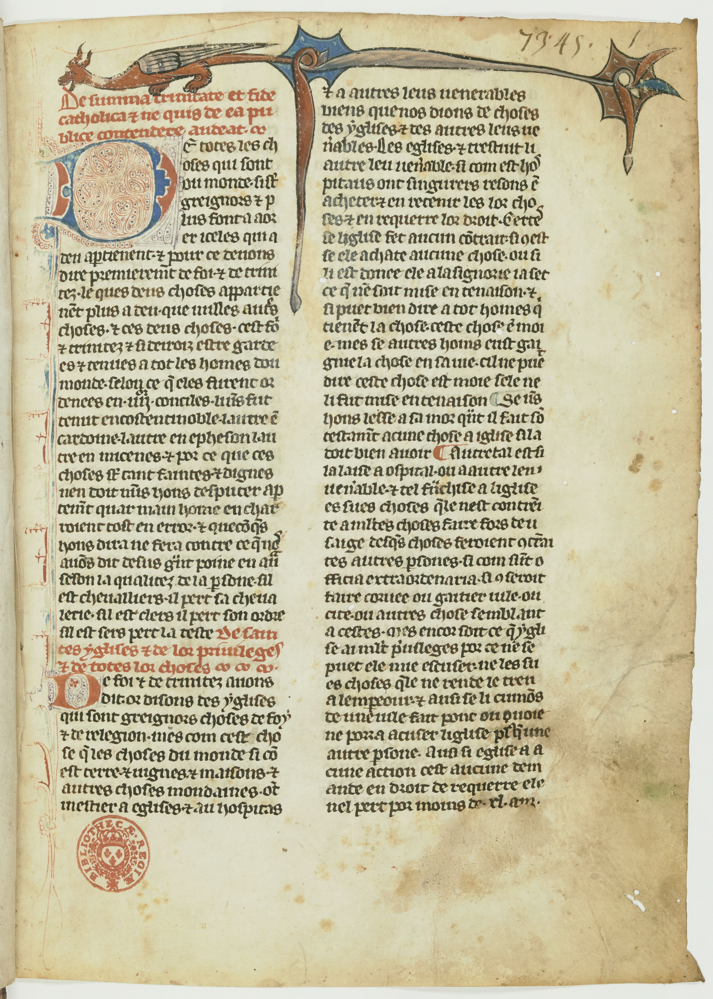

[comment1]: <1> (Penser à installer mes dossiers )

[comment2]: <1> (Présentation de la séance de rattrapage : )

[comment3]: <1> (- Suivre le diaporama sur github : un lien dans le moodle)

# Introduction
[comment4]: <1> (TITRE1)

## Course de vitesse ! 

### <2>

**Une prédiction HTR**

HTR = *Handwritten Text Recognition*

C'est la transcription automatique d'un manuscrit complet à partir des photos de Gallica.

**Faisons un petit test de rapidité**

1. Télécharger le fichier `code-roman.odt` depuis Moodle ([**ici**](https://pedag.u-picardie.fr/moodle/upjv/mod/resource/view.php?id=264649))

2. L'ouvrir dans LibreOffice Writer

3. Pour améliorer la mise en page du document, on veut mettre toutes les mentions \
`[Fol. 1r]`, `[Fol. 1v]`, etc. \
jusqu'à `[Fol. 109r]` \
**en gras et en taille 16 pt**.

4. Prêtes ? Prêts ?

### <3>

**Conclusion**

Pour bien exploiter un logiciel de traitement de texte, il faut se servir de la **feuilles de style** (*stylesheet*) qui lui est associée.

## Structuration des textes sur le web 

### <4>

Le dossier `f844_site` contient tous les fichiers qui constituent **un site web**, et même s'il n'est pas publié sur le web, on peut le consulter comme un site, localement.

1. Télécharger tout le dossier `f844_site` depuis Moodle ([**ici**](https://pedag.u-picardie.fr/moodle/upjv/mod/resource/view.php?id=264668))

2. Extraire le contenu

3. Ouvrir **Firefox**. Dans Firefox, faire Cmd + O sur Mac ou Ctrl + O sur PC pour ouvrir un fichier

4. Naviguer dans les dossiers pour ouvrir le fichier `f844_site/html/fr844-accueil.html`.

Vous pouvez désormais visiter le site !

### <5>

Depuis la page d'accueil, aller sur **Le manuscrit**

La page affichée présente un manuscrit contenant des chansonniers médiévaux.

Il y a plusieurs niveaux de titres : 

1. Le grand titre de la page : *Le Manuscrit du Roi (Paris BnF fr. 844) 1260-1325*

2. Des titres de parties : *Description matérielle*

3. Un sous-niveau : *Support*, *Importance matérielle*, *Foliotation*, *Collation des cahiers*, etc.

Comment cela est-il mis en forme ?

### <6>

Pour le savoir, il faut afficher le **code-source** de la page en faisant **Cmd + U** sur Mac ou **Ctrl + U** sur PC

Alors, comment les titres sont-ils mis en forme ? On peut chercher « Description matérielle » dans la page…

### <7>

Les éléments `<h1>`, `<h2>` constituent des **balises** des titres, et selon leur position dans la hiérarchie du document, elles sont interprétées par les **feuilles de style** (*stylesheet*) renseignées en haut du document (lignes 7 et 8).

Tous les contenus que vous consultez sur le web sont structurés de cette façon, en langage **HTML**.

**Les traitements de texte que vous produisez** fonctionnent de la même manière et sont fondés sur un langage cousin, le XML.

## Appliquer une feuille de style 

### <8>

Nous allons appliquer une feuille de style pour les titres et les citations d'un document dont tous les paragraphes ont pour l'instant un style par défaut de LibreOffice Writer.

1. Télécharger le dossier `vertus` depuis le Moddle  ([**ici**](https://pedag.u-picardie.fr/moodle/upjv/mod/folder/view.php?id=265116))

2. Extraire le contenu et ouvrir le fichier `vertus-en-forme.pdf` : il présente **le résultat que l'on souhaite obtenir**.

3. Ouvrir dans **LibreOffice Writer** le fichier `vertus-brut.odt`

### <9>

On va d'abord **appliquer des styles sans se préoccuper de leur apparence**.

1. Dans LibreOffice Writer, ouvrir le **panneau latéral** > Styles > Styles de paragraphe

2. En bas du panneau, avec le menu, choisir **Tous les styles**

### <10>

D'après le modèle indiqué par `vertus-en-forme.pdf`, appliquer les styles suivants là où c'est pertinent :

- Titre 1 (attention, il y en a au début et aussi à la fin du document : « Illustrations », « Bibliographie »)
- Titre 2
- Titre 3
- Titre 4

Appliquer aussi :

- `Citations`
- `Liste`

### <11>

C'est le moment de **créer un style personnalisé** pour les citations que l'on veut rendre en italique (p. 5 du pdf, et il y en a d'autres après).

1. Sélectionner le morceau de texte concerné

2. Toujours dans le panneau latéral : **Actions sur les styles** > Nouveau style à partir de la sélection

3. Nommer le nouveau style, par ex. : « Citations langues étrangères » (on peut abréger…)

4. Appliquer ce nouveau style aux autre paragraphes concernés de la suite du document.

## Insérer un commentaire 

### <12>

Pour commenter un passage du texte, deux solutions sont possibles :

1. Ecrire son commentaire dans le texte en appliquant un **style de caractère** particulier, par exemple **Accentuation forte**.

2. Sélectionner la partie du texte problématique et écrire une bulle commentaire : **Insertion** > Commentaire

# Étape 2
[comment9]: <12> (TITRE1)

[comment10]: <12> (Reprise pour passer de l'étape 2 à 3)

[comment11]: <12> (Faire appel aux styles de titres permet :)

[comment12]: <12> (- De modifier de manière homogène la mise en forme)

[comment13]: <12> (De répercuter les propriétés des styles sur leurs enfants : il y a des relations de hiérarchie entre les styles, les enfants héritent les caractères des parents)

[comment14]: <12> (- De bien gérer les enchaînements de paragraphes --un style de titre est toujours collé au paragraphe suivant)

[comment15]: <12> (- De créer une table des matières)

[comment16]: <12> (Auj. on va commencer par modifier ces styles en veillant à :)

[comment17]: <12> (Utiliser la hiérarchie des styles, on veut passer Titre 1, 2 et 3 en Georgia, on va mettre tous les titres en Georgia au lieu de faire la même chose trois fois)

[comment18]: <12> (- Ne pas utiliser la touche entrée, car encore une fois on veut gérer proprement les enchaînements de paragraphes)

[comment19]: <12> (- Faire des modifications basiques sur les polices, les effets de caractères etc.)

[comment20]: <12> (2^e^ chose. On a travaillé sur un document de type article ; mais ce qui nous intéresse c'est de faire un mémoire : on va travailler sur la mise en page.)

[comment21]: <12> (- Créer une page de titre, pour l'instant très basique, avec simplement un titre, on pourra l'élaborer plus tard)

[comment22]: <12> (- Prévoir l'impression du mémoire recto-verso.)

[comment23]: <12> (On entre dans de la typographie un peu spécifique : la mise en page d'imprimerie observe certaines règles pas évidentes à appliquer dans un traitement de texte basique.)

[comment24]: <12> (- Les **pages de titres** sont toujours à droite, même s'il faut laisser un blanc à gauche)

[comment25]: <12> (- La position des numéros alterne sur la page de droite et la page de gauche)

[comment26]: <12> (- Si on laisse un blanc avant une page de titre, il ne faut pas de numéro sur la page blanche)

[comment27]: <12> (- Et on ne veut évidemment pas de numéro sur la première et c'est mieux de ne pas en avoir non plus sur les autres pages de titre)

[comment28]: <12> (- On peut faire des titres courants : qui rappellent le chapitre et la sous partie)

[comment29]: <12> (Pour faire tout cela on va utiliser des styles de pages : pour avoir une Première page qui sera le titre du mémoire, et une succession de page gauche et de page droite)

[comment30]: <12> (Une fois qu'on aura fait cela, on ajoutera à notre titre de Chapitre la mention « Chapitre 1 »)

[comment31]: <12> (Puis on crééra la table des matières, à laquelle on donnera la même apparence qu'un Titre 1, mais si on en faisait un Titre 1 elle donnerait elle-même sa pagination.)

## Modifier les styles 

### <13>

[comment33]: <13> (**ATTENTION** Il faudrait que j'intègre les propriétés de style dans les diapos : le document modèle parasite plutôt qu'autre chose.)

Vous avez sans doute déjà remarqué que les styles ont des relations hiérarchiques. 

En bas du panneau latéral, ouvrir le menu et cliquer sur **Hiérarchie**.

Il existe un style **Titre** sous lequel sont énumérés les titres que l'on a utilisés : Titre 1, Titre 2…

On souhaite appliquer une propriété de style commune à Titre 1, Titre 2, Titre 3 : la police **Georgia**.

Cliquer sur **Modifier** au niveau de Titre et appliquer la police souhaitée.

### <14>

Faire de même avec le style **Citations** car on souhaite que celle-ci ainsi que **Citations langue étrangère** partagent une propriété : une taille de police à **10 pt**.

### <15>

Maintenant que l'on a appliqué les **styles qui nous seront utiles**, il est commode de n'afficher que ceux-là.

En bas du panneau latéral, ouvrir le menu et cliquer sur **Styles appliqués**.

On y voit plus clair !

### <16>

Un autre style va répercuter ses propriétés sur d'autres : **Style de paragraphe par défaut**.

En le modifiant, on modifiera du même coup **Citations** et **Liste**

- Passer **Style de paragraphe par défaut** en Times New Roman
- Lui appliquer aussi un **Alignement** justifié
- Lui appliquer, dans **Retraits et espacement** 
	- Un retrait de première de 1 cm
	- Un interligne de 1,5 pt

On constate que les paragraphes de texte et de citations ont bien reçu ces propriétés, mais que les citations ont aussi conservé leur propriété spécifique : la taille de 10 pt.

### <17>

À présent, il faut appliquer les propriétés spécifiques de chaque style.

On souhaite en particulier **espacer les titres et les blocs de texte**, en laissant notamment un grand espace sous le Titre 1.

Il ne faut pas sauter de lignes avec la touche Entrée, mais modifier le Titre 1 en intervenant sur les propriétés de **Retraits et espacement** > Espacement :

- Au-dessus du paragraphe : 0,5 cm
- Sous le par. : 2 cm

### <18>

- Appliquer les autres modifications au Titre 1 en suivant les **bulles commentaires du document pdf**

- Faire de même pour les autres titres

- Terminer la mise en forme en modifiant le style **Citations langue étrangère** : italique.

[comment34]: <18> (L'année prochaine, placer ici « Importer/exporter un style ».)

## Mettre en page un mémoire 

### <19>

On a désormais une mise en page très satisfaisante pour un article de revue. Mais un mémoire est une composition plus complexe : avec plusieurs chapitres, une table des matières, etc.

On imagine que notre **Titre 1** est un titre de chapitre

Il faut à présent créer une **page de titre** pour l'ensemble du mémoire :

- Sauter une ligne avant *Réinventer les Vertus à Cluny*
- Ecrire un titre de mémoire (réel ou inventé)
- Chercher parmi tous les styles de paragraphes préexistants **Titre principal** et l'appliquer au titre du mémoire

### <20>

On veut que chaque chapitre commence au début d'une page, il faut donc **modifier le Titre 1** :

- **Enchaînements** > Sauts > Insérer
	- Type : Page
	- Position : avant

Désormais notre chapitre ainsi que la table des illustrations et la bibliographie commencent en haut d'une nouvelle page.

Mais si l'on veut faire une mise en page dans les règles de l'art, il faut que nos Titre 1 soient **sur une page impaire** (à droite quand on tient le mémoire imprimé ouvert entre ses mains), or votre titre *Réinventer les Vertus…* se trouve actuellement sur la p. 2…

### <21>

Il faut donc définir des **Styles de pages** (bouton situé dans le même menu que Styles de paragraphes et Styles de caractères).

- Se placer tout au début du document : à la page de titre
- Choisir comme Styles de pages > **Première page**

Une fois appliqué, modifier ce style Première page :

- **Page** > Paramètres de mise en page > Mise en page > Droite uniquement
- **Gestionnaire** > Style de suite > Page gauche

Désormais la première page (impaire) est suivie d'une alternance de **Page gauche** (paire) et de **Page droite** (impaire) ; l'information doit apparaître tout en bas de la fenêtre de LibreOffice quand vous placez votre curseur dans les différentes pages du document.

### <22>

Nos débuts de chapitres, table des ill. et biblio, bref, les **Titre 1** doivent toujours être placés à droite et se comporter comme la première page

- Modifier le Titre 1
- **Enchaînements** > Sauts > Avec le style de page > Première page

### <23>

Afin de faire apparaître un **titre courant** pour nos chapitres, pour la biblio, etc. en haut des pages, il faut définir une **numérotation des chapitres**.

- **Outils** > Numérotation des chapitres
- Style de paragraphe > Titre 1

Mais comme cela compliquerait beaucoup la gestion du document, on crée cette numérotation mais on ne l'affiche pas (pour ne pas se retrouver avec « Chapitre 2 Bibliographie » !). Donc, toujours dans le menu Numérotation des chapitres :

- Nombre : Aucun

On écrira plus tard « Chapitre 1 » à la main.

### <24>

Il ne reste plus qu'à ajouter des **numéros de pages** et des **titres courants**. 

Naturellement, on n'en veut pas sur la page de titre, mais comme nos pages ont maintenant leurs propres styles, numéroter les pages de droite et de gauche n'affectera pas les pages de titre.

Pour poser ces numéros et ces titres courants, il faut commencer par activer les en-têtes et pieds de page :

- Modifier le style de page **Page droite**
- Pied de page > Activer
- En-tête > Activer
- Réitérer pour **Page gauche**

### <25>

On peut désormais ajouter les numéros :

- Cliquer sur le bas d'une page gauche
- **Insertion** > Numéro de page
- **Aligner à gauche** le numéro que l'on vient de créer (cela se répercute sur toutes les pages du style)
- Réitérer pour créer les numéros de la page droite, où on alignera les numéros à droite

### <26>

On peut désormais ajouter les titres courants :

- Cliquer sur le haut d'une page droite
- **Insertion** > Champ > Autres champs
- Onglet **Document**
- Type : Chapitre
- Format : Nom de chapitre
- Niveau 1

**Aligner à droite** le titre courant créé.

### <27>

On peut afficher les titres courants des sous-parties (Titre 2) sur les pages gauches :

- Cliquer sur le haut d'une page gauche
- **Insertion** > Champ > Autres champs
- Onglet **Document**
- Type : Chapitre
- Format : Nom de chapitre
- Niveau 2

### <28>

Félicitations ! Vous avez maintenant une mise en page très professionnelle !

Vous pouvez transformer le document en pdf comme pour l'imprimer en recto-verso :

- **Fichier** > Imprimer
- Dans l'onglet **Standard** > Imprimante > Imprimer dans un fichier
- Dans l'onglet **Libre OfficeWriter** > Pages > Imprimer les pages blanches insérées automatiquement
- Lancer l'impression

La p. 2, verso de la page de titre, reste blanche et sans numéro pour que le chapitre commence sur la page impaire suivante.

[comment36]: <28> (Faire un retour chariot pour le titre)

## Préparer une table des matières 

### <29>

Notre titre de chapitre n'en est pas vraiment un… 

On voudrait **ajouter « Chapitre 1 »** au-dessus de « Réinventer les Vertus à Cluny » comme dans le modèle pdf. 

**Attention** : si on écrit « Chapitre 1 » au début de la ligne « Réinventer… » et que l'on tape **Entrée**, on a un gros problème ! « Chapitre 1 » devient un Titre 1 à lui seul, et donc un saut de page sépare « Chapitre 1 » de « Réinventer… »

Pour revenir correctement à la ligne après « Chapitre 1 », il faut faire un *retour chariot* : **Maj + Entrée**

### <30>

Il est préférable de mettre en forme « Chapitre 1 » de façon plus discrète que le contenu du titre qu'il introduit.

Mais comme « Chapitre 1 » doit rester en style de paragraphe Titre 1, il faut **créer un style de caractère** que l'on pourra appeler, par ex. : Chapitre.

- Sélectionner « Chapitre 1 »
- Cliquer sur **Nouveau style à partir de la sélection**
- Modifier ce nouveau style :
	- Effets de caractère > Effets > Casse > (Sans)
	- Police > Taille > 28 pt.

### <31>

On va à présent ajouter la table des matières pour de bon.

- Se placer à la fin du document
- Revenir à la ligne (**Entrée**) si le curseur est à la fin d'une ligne
- **Insertion** > Tables des matières et index > Tables des matières, etc.
- Dans le menu, ne rien changer > **Ok**

### <32>

Nous avons une table des matières (TDM), collée à la fin de la bibliographie.

On ne donne pas la page de la TDM dans la TDM. C'est logique ! Donc on ne veut pas transformer le titre de la TDM en Titre 1, car elle serait alors prise en compte et ajoutée.

De nouveaux styles de paragraphes sont apparus dans la liste des **Styles appliqués**, dont **Titre de table des matières**.

### <33>

Modifier **Titre de table des matières** pour le faire ressembler au Titre 1 :

- **Enchaînements** > Sauts 
	- Insérer :
		- Type : Page
		- Position : Avant
	- Avec le style de page : Première page
- Police : Georgia, normal
- Retraits et espacement : 0,5 au-dessus ; 2 en-dessous
- Effets de caractère : casse en Petites majuscules
- Alignement : centrer

## Importer/exporter un style 

### <34>

Faire un style de document, c'est bien ; pouvoir le réutiliser, c'est mieux !
On va exporter le style que l'on vient d'élaborer pour l'appliquer à un nouveau document.

- Cliquer sur **Fichier** > Modèles > Enregistre comme modèle
- Sélectionner la catégorie du modèle : **Styles**
- Donner un nom, par ex. « Mémoire »

Le style est sauvegardé.

### <35>

Récupérons maintenant un document structuré dont le style est différent.
On peut reprendre du Moodle le document `vertus-etape-2.odt` en cliquant [**ici**](https://pedag.u-picardie.fr/moodle/upjv/pluginfile.php/930077/mod_folder/content/0/vertus-etape-2.odt?forcedownload=1)

- Renommer ce document pour ne pas le confondre : ce sera un simple test, `test.odt` peut faire l'affaire
- Ouvrir ce fichier et aller sur **Styles** > Charger des styles depuis un modèle
- Sélectionner dans la catégorie Styles notre modèle Mémoire
- Cliquer sur **Ecraser**, puis Ok.

Est-ce que les styles ont bien été appliqués ?…
